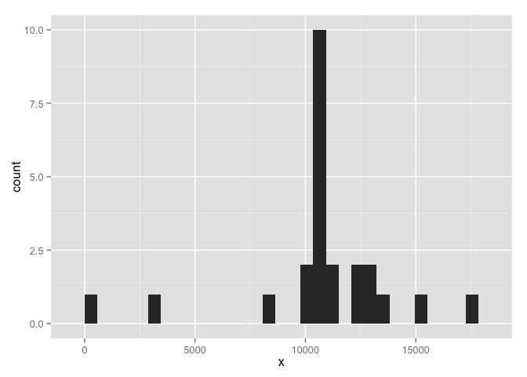

Loading and preprocessing the data


```r
library(plyr)
library (dplyr)
```

```
## 
## Attaching package: 'dplyr'
## 
## The following objects are masked from 'package:plyr':
## 
##     arrange, count, desc, failwith, id, mutate, rename, summarise,
##     summarize
## 
## The following objects are masked from 'package:stats':
## 
##     filter, lag
## 
## The following objects are masked from 'package:base':
## 
##     intersect, setdiff, setequal, union
```

```r
library(ggplot2)
activity<-read.csv("activity.csv")
activity$date<-as.Date(activity$date,"%Y-%d-%m")
```

What is mean total number of steps taken per day?


```r
sum_per_day<-aggregate(activity$steps, by=list(activity$date),sum)

ggplot(sum_per_day, aes(x=x)) + geom_histogram()
```

```
## stat_bin: binwidth defaulted to range/30. Use 'binwidth = x' to adjust this.
```

 

```r
median(sum_per_day$x,na.rm = TRUE)
```

```
## [1] 10890
```

```r
mean(sum_per_day$x,na.rm = TRUE)
```

```
## [1] 10729.94
```

What is the average daily activity pattern?


```r
mean_per_interval<-aggregate(activity$steps,by=list(activity$interval),mean,na.rm=TRUE)
plot(mean_per_interval$Group.1, mean_per_interval$x, type="l")
```

 

```r
mean_per_interval[which.max(mean_per_interval$x),1]
```

```
## [1] 835
```

Imputing missing values


```r
sum(is.na(activity$steps) | is.na(activity$date) )
```

```
## [1] 12384
```

```r
activity_comp<-merge(activity,mean_per_interval, by.x = c("interval"), by.y = c("Group.1"))
activity_comp[which(is.na(activity_comp$steps)),2]<-activity_comp[which(is.na(activity_comp$steps)),4]

activity_comp$x<-NULL    
sum_per_day_comp<-aggregate(activity_comp$steps, by=list(activity_comp$date),sum)
ggplot(sum_per_day_comp, aes(x=x)) + geom_histogram()    
```

```
## stat_bin: binwidth defaulted to range/30. Use 'binwidth = x' to adjust this.
```

 


Are there differences in activity patterns between weekdays and weekends?


```r
median(sum_per_day_comp$x,na.rm = TRUE)
```

```
## [1] 10766.19
```

```r
mean(sum_per_day_comp$x,na.rm = TRUE)
```

```
## [1] 10739.01
```

-> the mean and the median did not change much

Are there differences in activity patterns between weekdays and weekends?

```r
activity_comp$days<-weekdays(activity_comp$date)
activity_comp[which(activity_comp$days=="Saturday"| activity_comp$days=="Sunday"),5]<-"weekend"
activity_comp[which(activity_comp$days=="Monday" | activity_comp$days=="Tuesday"),5]<-"weekday"
activity_comp[which(activity_comp$days=="Wednesday" | activity_comp$days=="Thursday"),5]<-"weekday"
activity_comp[which(activity_comp$days=="Friday" ),5]<-"weekday"

mean_per_interval_comp<-aggregate(activity_comp$steps,by=list(activity$interval),mean,na.rm=TRUE)
plot(mean_per_interval_comp$Group.1, mean_per_interval$x, type="l")
```

 
